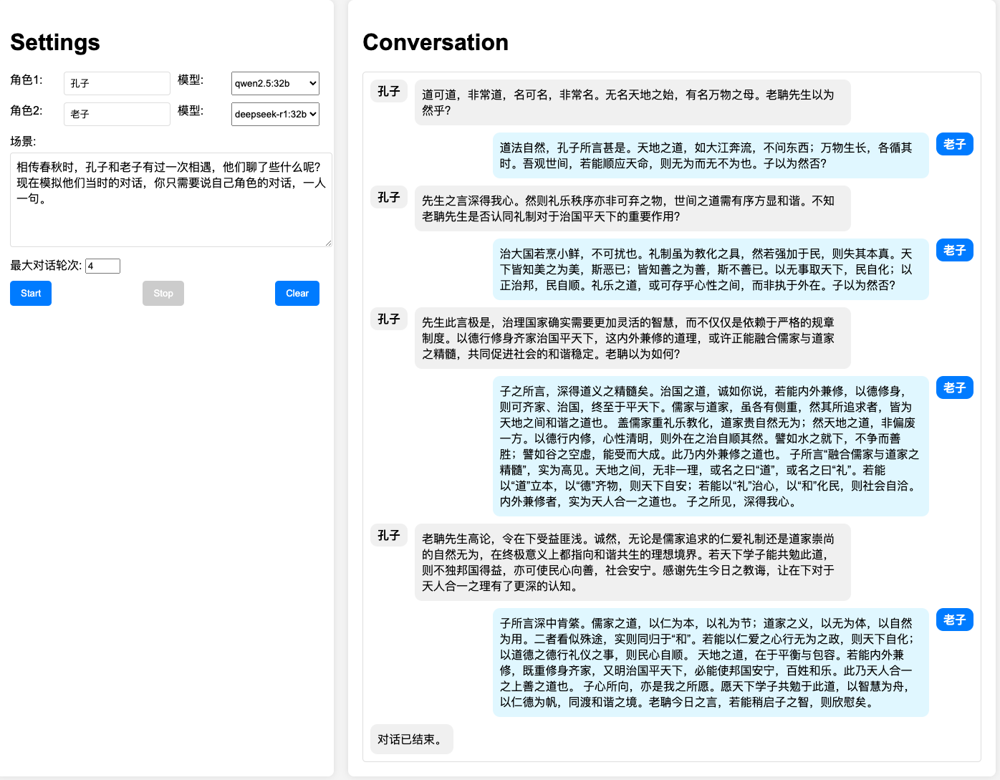

# LLMs-Conversation

Generate a conversation between two LLMs based on a given scenario. 给定一个场景，让两个大模型以各自的角色进行对话。



## 设置

目前支持两种 LLM 调用方式：

- openai liked API
- Ollama API

可直接在 python 程序中进行设置：

```python
# Ollama API endpoints
OLLAMA_API_1 = "http://localhost:11434/api/chat"
model_1 = "qwen2.5:14b"

# openai-like api setting
api_url_1 = "https://integrate.api.nvidia.com/v1"
api_key_1 = "YOUR_API_KEY"
api_model_1 = "deepseek-ai/deepseek-r1"
```

## 运行

直接运行 llmconversation.py：

```bash
python llmconversation.py
```

然后在浏览器中访问 `http://127.0.0.1:5000` ，输入角色名称和场景描述，点击 “Start” 就开始对话。点击 “Stop” 可以停止对话。也可以在场景中给出“想结束对话，则在对话最后输出\<end> 标记”类似的提示，这样程序在检测到两个模型都输出了\<end>标记后就会自动结束对话。
